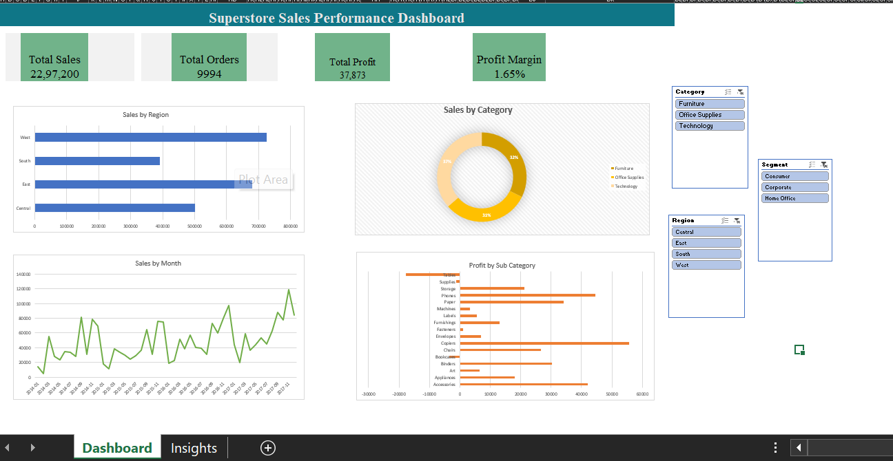

# Superstore Sales Performance Dashboard

## Overview
Interactive sales performance dashboard built in Excel analyzing 10,000+ transactions from a retail superstore across regions, categories and time periods.

## Tools Used
- Microsoft Excel
- Pivot Tables
- Pivot Charts
- Slicers (Interactive Filters)

## Dataset
- Source: Superstore Sales Dataset (Kaggle)
- Size: 9,994 rows, 21 columns
- Period: 2014 - 2017

## What I Built
- KPI tracking dashboard (Total Sales, Orders, Profit, Profit Margin)
- 4 interactive charts (Bar, Donut, Line, Horizontal Bar)
- 3 slicers for filtering by Region, Category and Segment
- Business insights sheet with recommendations

## Key Findings
- Profit margin is critically low at 1.65% suggesting heavy over-discounting
- West and East regions contribute 61% of total revenue
- Technology is the top selling category at $836,154
- Tables are the biggest loss maker at -$17,725
- Sales show consistent year over year growth with Q4 spikes

## Dashboard Preview

